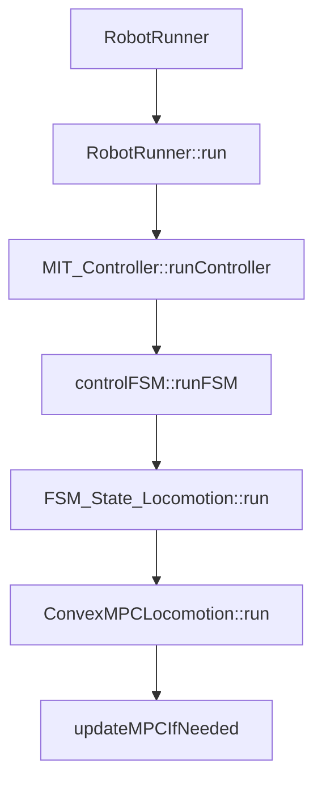

### mini-cheetah MPC 反作用力规划

#### 理论部分

* 对于单输入单输出（SISO）系统，$u$ 代表输入，$e$ 代表误差，即有当 $\int e^2dt$ 越小时，表示跟踪效果越好；当 $\int u^2dt$ 越小时，表示能耗越低。可以写成代价函数形式，即：$J= \int qe^2dt+\int ru^2dt$ 通过调节参数 $q$ 、$r$  来获取想要的效果。
* 对于多输入多输出系统（MIMO），有系统的状态方程：

$$
\begin{align}
&\frac{dx}{dt}=Ax+Bu \\
&y=Cx

\end{align}
$$

此时，  代价函数 $J=\int (E^TQE+U^TRU)dt$ ，$Q$、$R$ 也被称为权值矩阵。

* 模型预测控制（MPC）：通过模型来预测系统在某一段时间段内的表现来进行优化控制。当有系统的状态方程 $x_{k+1}=Ax_k+Bu_k$ ，**MPC** 共有以下三个步骤： 

假设系统在第 $k$ 时刻：

1. 估计/测量读取当前的系统状态
2. 基于 $u_k$ , $u_{k+1}$ , $\cdot$ $\cdot$ $\cdot$ ,$u_{k+N}$ 来进行优化，$J= \sum\limits_k^{N-1}E_k^TQE_k+U_K^TQU_K+E_N^TFE_N$ 
3. 只取 **$u_k$**    

下面开始推导如何将 $J$ 转化为二次规划 $QP$ 形式：

设在第 $k$ 时刻开始预测，预测区间为 $N$ :
$$
X_k=\begin{bmatrix}
x(k) \\
x(k+1|k) \\
x(k+2|k) \\
\vdots \\
x(k+N|k)
\end{bmatrix}_{}

& & 
U_k=\begin{bmatrix}
u(k|k) \\
u(k+1|k) \\
\vdots \\
u(k+N-1|k)
\end{bmatrix}
$$
括号后面的 $k$ 表示在第 $k$ 时刻进行预测，把预测的 $x(k+i|k)$ 和 $u(k+i|k)$ 写成向量的形式 $X_k$ 和 $U_k$ 。设输出 $y=x$ ，参考 $R=0$ ，误差 $E=y-R=x-0=x$ 。此时，代价函数 $J$ :
$$
min \ J=\sum\limits_{i=0}^N(x(k+i|k)^TQx(k+i|x))+(u(k+i|k)^TRu(k+i|k))+x(k+N|k)^TFx(k+N|k)
$$
继续利用系统的状态方程：
$$
\begin{align}
&x(k|k) = x_k \\
&x(k+1|k) = Ax(k|k)+Bu(k|k)=Ax_k+Bu_k \\
&x(k+2|k) = Ax(k+1|k)+Bu(k+1|k)=A^2x_k+ABu_k+Bu(k+1|k) \\
&\cdots \\
&x(k+N|k) = A^Nx_k+A^{N-1}Bu(k|k)+\cdots+Bu(k|k)
\end{align}
$$
写成矩阵形式：
$$
X_k=\begin{bmatrix}
I \\
A \\
A^2 \\
\vdots \\
A^N
\end{bmatrix} x_k + 
\begin{bmatrix}
0 & 0 & \cdots &   0 \\
B \\
AB & B \\
\vdots  \\
A^{N-1}B & A^{N-2}B & \cdots & B
\end{bmatrix}
\begin{bmatrix}
u(k|k) \\
\vdots \\
u(k+N-1|k)
\end{bmatrix}
$$
简化一下，请注意区分大小写：
$$
X_k=Mx_k+CU_k
$$
回过头来推导代价函数 $J$ :
$$
\begin{align}
J&=\sum\limits_{i=0}^N(x(k+i|k)^TQx(k+i|x))+(u(k+i|k)^TRu(k+i|k))+x(k+N|k)^TFx(k+N|k) \\
&=x(k|k)^TQx(k|x)+x(k+1|k)^TQx(k+1|x)+\cdots+x(k+N|k)^TQx(k+N|x)+u(k|k)^TRu(k|k)+\cdots+u(k+N-1|k)^TRu(k+N-1|k)
\end{align}
$$
写成矩阵形式：
$$
J=\begin{bmatrix}
x(k|k) \\
x(k+1|k) \\
\vdots \\
x(k+N|k)
\end{bmatrix}^T 
\begin{bmatrix}
Q  \\
 & Q \\
 & &  \ddots \\
 & & & F
\end{bmatrix}
\begin{bmatrix}
x(k|k) \\
x(k+1|k) \\
\vdots \\
x(k+N|k)
\end{bmatrix}+
\begin{bmatrix}
u(k|k) \\
u(k+1|k) \\
\vdots \\
u(k+N-1|k)
\end{bmatrix}^T
\begin{bmatrix}
R  \\
 & R \\
 & &  \ddots \\
 & & & R
\end{bmatrix}
\begin{bmatrix}
u(k|k) \\
u(k+1|k) \\
\vdots \\
u(k+N-1|k)
\end{bmatrix}
$$
简化一下：
$$
\begin{align}
J&=X_k^T\overline{Q}X_k+U_k\overline{R}U_k \\
&=(Mx_k+CU_k)^T\overline{Q}(Mx_k+CU_k)+U_k\overline{R}U_k \\
&=(x_k^TM^T+U_k^TC^T)\overline{Q}(Mx_k+CU_k)+U_k\overline{R}U_k \\
&=x_k^TM^T\overline{Q}Mx_k+x_k^TM^T\overline{Q}CU_k+U_k^TC^T\overline{Q}Mx_k+U_k^TC^T\overline{Q}CU_k+U_k\overline{R}U_k \\
&=x_k^TGx_k+2x_k^TEU_k+U_k^THU_k
\end{align}
$$
其中，$G=M^T \overline{Q}M $ ，$H=C^T\overline{Q}C+\overline{R}$ ，$M^T\overline{Q}C$ 。

至此我们把MPC的代价函数 $J$ 转换成了**QP**问题。
$$
J=x_k^TGx_k+2x_k^TEU_k+U_k^THU_k
$$


#### 代码部分

* **ConvexMPCLocomotion** 类是进行MPC规划的核心类。从头来看，在 **RobotRunner** 的 **run** 中，经过条件判断进入机器人控制器对象的 **RobotController::runController()** ，由于继承关系，实际上进入的是 **MIT_Controller::runController()** 。重点关注 **controlFSM::runFSM** 。**controlFSM** 是一个有限状态机管理类，管理如MPC、视觉融合等众多控制器，这里不对**controlFSM** 中控制器的状态管理切换赘述。假设当前的状态是 **locomotion** ，对 **locomotion** 状态的处理类是 **FSM_State_Locomotion** 。从而进入了 **FSM_State_Locomotion::run()** ，最终进入了 **ConvexMPCLocomotion::run()** 。 在 **ConvexMPCLocomotion::run()** 中，并不是每次迭代都会进行MPC求解，这是由于此类中含有步态规划，在 **Minicheetah** 中，以trot步态为例，一个步态周期需要求解10次MPC，求解一次MPC前需要先进行13次迭代。之所以求解MPC与步态规划联系如此紧密，是因为MPC求解的是地面对足端的作用力，需要时刻清楚每条腿现在以及未来的触地情况。
* 在进行13次迭代之后，程序会顺利执行 **updateMPCIfNeeded** ，也就是 **MPC** 求解足端作用力。整个代码的进行流程如下图所示：




##### ConvexMPCLocomotion初始化

* 在此之前先来分析一下整个的初始化过程，在 **FSM_State_Locomotion** 的构造函数完成对 **ConvexMPCLocomotion** 对象的创建，在 **ConvexMPCLocomotion** 的构造函数中，代码如下：

```c++
{
  _parameters = parameters;
  dtMPC = dt * iterationsBetweenMPC;
  default_iterations_between_mpc = iterationsBetweenMPC;
  printf("[Convex MPC] dt: %.3f iterations: %d, dtMPC: %.3f\n", dt, iterationsBetweenMPC, dtMPC);
  setup_problem(dtMPC, horizonLength, 0.4, 120);
  //setup_problem(dtMPC, horizonLength, 0.4, 650); // DH
  rpy_comp[0] = 0;
  rpy_comp[1] = 0;
  rpy_comp[2] = 0;
  rpy_int[0] = 0;
  rpy_int[1] = 0;
  rpy_int[2] = 0;

  for(int i = 0; i < 4; i++)
    firstSwing[i] = true;

  initSparseMPC();

   pBody_des.setZero();
   vBody_des.setZero();
   aBody_des.setZero();
}
```

初始化主要是一些参数的赋值，和 **setup_problem** 、**initSparseMPC** 两个函数。其中 **setup_problem** 代码如下：

```c++
void setup_problem(double dt, int horizon, double mu, double f_max)
{
  //mu = 0.6;
  if(first_run)
  {
    first_run = false;
    //初始化互斥锁
    initialize_mpc();
  }

#ifdef K_DEBUG
  printf("[MPC] Got new problem configuration!\n");
    printf("[MPC] Prediction horizon length: %d\n      Force limit: %.3f, friction %.3f\n      dt: %.3f\n",
            horizon,f_max,mu,dt);
#endif

  //pthread_mutex_lock(&problem_cfg_mt);
  //QP问题的参数
  problem_configuration.horizon = horizon;
  problem_configuration.f_max = f_max;
  problem_configuration.mu = mu;
  problem_configuration.dt = dt;

  //pthread_mutex_unlock(&problem_cfg_mt);
  //根据预测长度horizon重新定义QP问题向量的大小和分配内存
  resize_qp_mats(horizon);
}
```

**initSparseMPC** 代码如下：

```c++
void ConvexMPCLocomotion::initSparseMPC() {
  Mat3<double> baseInertia;
  //机器人的惯性张量
  baseInertia << 0.07, 0, 0,
              0, 0.26, 0,
              0, 0, 0.242;
  //质量
  double mass = 9;
  //最大力
  double maxForce = 120;
   
  //dtTraj是预测未来10步中，每步的时间
  std::vector<double> dtTraj;
  for(int i = 0; i < horizonLength; i++) {
    dtTraj.push_back(dtMPC);
  }
  //权重参数，之后会重新传入
  Vec12<double> weights;
  weights << 0.25, 0.25, 10, 2, 2, 20, 0, 0, 0.3, 0.2, 0.2, 0.2;
  //weights << 0,0,0,1,1,10,0,0,0,0.2,0.2,0;
  //设置_sparseCMPC参数
  _sparseCMPC.setRobotParameters(baseInertia, mass, maxForce);
  _sparseCMPC.setFriction(0.4);
  _sparseCMPC.setWeights(weights, 4e-5);
  _sparseCMPC.setDtTrajectory(dtTraj);

  _sparseTrajectory.resize(horizonLength);
}
```

* 总结：在初始化中，主要有：

1. 对一些参数赋初值
2. 根据预测长度重新定义向量的大小和分配QP问题向量的内存
3. 设置QP问题的参数
4. 设置sparseCMPC参数

##### updateMPCIfNeeded

* 在进入 **updateMPCIfNeeded** 之前，先获取一张表，其实就是一个一维数组。其中包含了足端在预测范围内是否触地的状态。

```
  int* mpcTable = gait->getMpcTable();
  updateMPCIfNeeded(mpcTable, data, omniMode);
```

* 在 **updateMPCIfNeeded** 中，主要是对机器人期望的状态进行预测，包括站立和非站立两种情况。在前面理论部分提到状态向量 $x_k$ ，这里具体是 

$$
x_k=\begin{bmatrix}
\Theta^T & p^T & \omega^T & \dot{p}^T
\end{bmatrix}^T
$$

其中 $\Theta$ 表示机器人的欧拉角，$p$ 表示机器人的位置，这二者描述机器人的自身运动状态；$\omega$ 表示机器人的角速度，$\dot{p}$ 表示机器人的线速度，这二者是对机器人的运动层面进行描述。

```c++
void ConvexMPCLocomotion::updateMPCIfNeeded(int *mpcTable, ControlFSMData<float> &data, bool omniMode) {
  //iterationsBetweenMPC = 30;
  if((iterationCounter % iterationsBetweenMPC) == 0)
  {
    //获取状态估计的结果
    auto seResult = data._stateEstimator->getResult();
    float* p = seResult.position.data();
    //机器人的速度
    Vec3<float> v_des_robot(_x_vel_des, _y_vel_des,0);
    //将机器人的速度转为世界坐标系
    Vec3<float> v_des_world = omniMode ? v_des_robot : seResult.rBody.transpose() * v_des_robot;
    //float trajInitial[12] = {0,0,0, 0,0,.25, 0,0,0,0,0,0};


    //printf("Position error: %.3f, integral %.3f\n", pxy_err[0], x_comp_integral);
    //站立状态下
    if(current_gait == 4)
    {
      //当前时刻的状态
      float trajInitial[12] = {
        _roll_des,
        _pitch_des /*-hw_i->state_estimator->se_ground_pitch*/,
        (float)stand_traj[5]/*+(float)stateCommand->data.stateDes[11]*/,
        (float)stand_traj[0]/*+(float)fsm->main_control_settings.p_des[0]*/,
        (float)stand_traj[1]/*+(float)fsm->main_control_settings.p_des[1]*/,
        (float)_body_height/*fsm->main_control_settings.p_des[2]*/,
        0,0,0,0,0,0};
      //由当前时刻估算未来时刻的状态，由于是站立，所以状态向量保持不变
      for(int i = 0; i < horizonLength; i++)
        for(int j = 0; j < 12; j++)
          trajAll[12*i+j] = trajInitial[j];
    }

    else
    {
      //非站立情况
      const float max_pos_error = .1;
      float xStart = world_position_desired[0];
      float yStart = world_position_desired[1];
      //机器人的期望位置与状态估计获取的位置相差不能太大
      if(xStart - p[0] > max_pos_error) xStart = p[0] + max_pos_error;
      if(p[0] - xStart > max_pos_error) xStart = p[0] - max_pos_error;

      if(yStart - p[1] > max_pos_error) yStart = p[1] + max_pos_error;
      if(p[1] - yStart > max_pos_error) yStart = p[1] - max_pos_error;
      
      world_position_desired[0] = xStart;
      world_position_desired[1] = yStart;
      //当前时刻的状态向量
      float trajInitial[12] = {(float)rpy_comp[0],  // 0 //含有补偿的roll和pitch
        (float)rpy_comp[1],    // 1
        _yaw_des,    // 2
        //yawStart,    // 2
        xStart,                                   // 3
        yStart,                                   // 4
        (float)_body_height,      // 5
        0,                                        // 6
        0,                                        // 7
        _yaw_turn_rate,  // 8
        v_des_world[0],                           // 9
        v_des_world[1],                           // 10
        0};                                       // 11
      //对状态的预测，长度是horizonLength
      for(int i = 0; i < horizonLength; i++)
      {
        for(int j = 0; j < 12; j++)
          trajAll[12*i+j] = trajInitial[j];

        if(i == 0) // start at current position  TODO consider not doing this
        {
          //trajAll[3] = hw_i->state_estimator->se_pBody[0];
          //trajAll[4] = hw_i->state_estimator->se_pBody[1];
          trajAll[2] = seResult.rpy[2];
        }
        else
        {
          //预测就是目标时刻的状态=上一时刻的状态+速度*时间
          trajAll[12*i + 3] = trajAll[12 * (i - 1) + 3] + dtMPC * v_des_world[0];
          trajAll[12*i + 4] = trajAll[12 * (i - 1) + 4] + dtMPC * v_des_world[1];
          trajAll[12*i + 2] = trajAll[12 * (i - 1) + 2] + dtMPC * _yaw_turn_rate;
        }
      }
    }

    Timer solveTimer;
    //根据参数选择求解mpc的方式
    if(_parameters->cmpc_use_sparse > 0.5) {
      solveSparseMPC(mpcTable, data);
    } else {
      solveDenseMPC(mpcTable, data);
    }
    //printf("TOTAL SOLVE TIME: %.3f\n", solveTimer.getMs());
  }

}
```

##### solveDenseMPC 

* 这里以 **solveDenseMPC** 为例，在这之前，需要推导一些公式，因为在之前的理论部分存在系统的状态方程，而在这里需要具体的形式。模型预测控制模型是关键，MIT使用的是单刚体模型，其动力学方程如下：

$$
\begin{align}
&\ddot{p}=\frac{\sum \limits_{i=1}^{n}f_i}{m}-g \\
&\frac{d}{dt}(I\omega)=\sum \limits_{i=1}^nr_i\times f_i
\\
&\dot{R}=[\omega]_{\times}R

\end{align}
$$

现在根据模型来推导机器人的状态方程：

1. 首先是 欧拉角 $\Theta$，当 $pitch$ 和 $roll$ 接近 $0$ 时：

$$
\begin{align}
\frac{d}{dt}(\Theta)&=\begin{bmatrix}
\dot{\phi} \\
\dot{\theta} \\
\dot{\psi} 
\end{bmatrix} \approx 
\begin{bmatrix}
cos(\psi) & sin(\psi) & 0 \\
-sin(\psi) & cos(\psi) & 0 \\
0 & 0 & 1
\end{bmatrix} 
\omega \\
&\approx R_z(\psi)\omega

\end{align}
$$

2. 对 $ \omega $ 求导：

$$
\begin{align}
此处第二项是因为求导操作是在非惯性系下进行的 \\
&\frac{d}{dt}(I\omega)=I\dot{\omega}+\omega \times (I\omega) \approx I\dot{w} \\
机器人相对于世界坐标系的惯性表达式： \\
&I = R I_B R^T \\
& \hat{I} = R_z(\psi)I_BR_z(\psi)^T \\
所以有: \\
&\dot{\omega}=I^{-1}\frac{d}{dt}(I\omega) \\
又因为： \\
&\frac{d}{dt}(I\omega)=\sum \limits_{i=1}^nr_i\times f_i \\
所以： \\
&\dot{\omega}=I^{-1}\sum \limits_{i=1}^nr_i\times f_i 

\end{align}
$$

3. 对 $p$ 求导就是 $\dot{p}$ 
4. 对 $\dot{p}$ 求导

$$
\ddot{p}=\frac{\sum \limits_{i=1}^{n}f_i}{m}-g
$$

把上述四者写成矩阵的形式有：
$$
\begin{align}
\frac{d}{dt} \begin{bmatrix}
\Theta \\
p \\
\omega \\
\dot{p} 
\end{bmatrix} = 
\begin{bmatrix}
0_{3\times3} & 0_{3\times3} & R_z(\psi) & 0_{3\times3} \\
0_{3\times3} & 0_{3\times3} & 0_{3\times3} & I_{3\times3} \\
0_{3\times3} & 0_{3\times3} & 0_{3\times3} & 0_{3\times3} \\
0_{3\times3} & 0_{3\times3} & 0_{3\times3} & 0_{3\times3} \\
\end{bmatrix}
\begin{bmatrix}
\Theta \\
p \\
\omega \\
\dot{p} 
\end{bmatrix}
+  \begin{bmatrix}
0_{3\times3} & 0_{3\times3} & 0_{3\times3} & 0_{3\times3} \\
0_{3\times3} & 0_{3\times3} & 0_{3\times3} & 0_{3\times3} \\
I^{-1}[r_1]_{\times} & I^{-1}[r_2]_{\times} & I^{-1}[r_3]_{\times} & I^{-1}[r_4]_{\times} \\
\frac{I_3}{m} & \frac{I_3}{m} & \frac{I_3}{m} & \frac{I_3}{m}

\end{bmatrix}
\begin{bmatrix}
f_1 \\
f_2 \\
f_3 \\
f_4 
\end{bmatrix} + 
\begin{bmatrix}
 0 \\
 0 \\
 0 \\
 g
\end{bmatrix}

\end{align}
$$
利用前向欧拉法将状态方程离散化：
$$
\begin{align}
&x(k+1)=A_kx(k)+B_ku(k) \\
&x(k+1) = 
\begin{bmatrix}
I_{3\times3} & 0_{3\times3} & R_z(\psi_k)\Delta T & 0_{3\times3} \\
0_{3\times3} & I_{3\times3} & 0_{3\times3} & I_{3\times3}\Delta T \\
0_{3\times3} & 0_{3\times3} & 0_{3\times3} & 0_{3\times3} \\
0_{3\times3} & 0_{3\times3} & 0_{3\times3} & 0_{3\times3} \\
\end{bmatrix}
x(k)
+  \begin{bmatrix}
0_{3\times3} & 0_{3\times3} & 0_{3\times3} & 0_{3\times3} \\
0_{3\times3} & 0_{3\times3} & 0_{3\times3} & 0_{3\times3} \\
I^{-1}[r_1]_{\times}\Delta T & I^{-1}[r_2]_{\times}\Delta T & I^{-1}[r_3]_{\times}\Delta T & I^{-1}[r_4]_{\times}\Delta T \\
\frac{I_3\Delta T}{m} & \frac{I_3\Delta T}{m} & \frac{I_3\Delta T}{m} & \frac{I_3\Delta T}{m}

\end{bmatrix}

u(k)
+ 
\begin{bmatrix}
 0 \\
 0 \\
 0 \\
 g
\end{bmatrix}

\end{align}
$$
在理论部分我们把代价函数 $J$ 推导成 $QP$ 问题的形式，具体在机器人上，代价函数的形式有所变化：
$$
\begin{align}
新的代价函数形式,原来误差e是x_i,现在是x_i-x_{i,ref}：\\
& min J=\sum \limits_{i=0}^{N}||x_{i+1}-x_{i+1,ref}||_{Q_i}+||u_i||_{R_i} \\
同样地，把所有x_i写成一个X：\\
&X=\begin{bmatrix}
I \\
A \\
A^2 \\
\vdots \\
A^N
\end{bmatrix} x_k + 
\begin{bmatrix}
0 & 0 & \cdots &   0 \\
B \\
AB & B \\
\vdots  \\
A^{N-1}B & A^{N-2}B & \cdots & B
\end{bmatrix} U \\
即： \\
&X=A_{qp}x(k)+B_{qp}U \\
同理，代价函数有： \\
& min J =(X-X^{ref})^TQ(X-X^{ref})+U^TRU \\
把X=A_{qp}x(k)+B_{qp}U代入：\\
&min J =(A_{qp}x(k)+B_{qp}U-X^{ref})^TQ(A_{qp}x(k)+B_{qp}U-X^{ref})+U^TRU \\
把转置放进括号里：\\
min J &=(x^{T}(k)A^{T}_{qp}+U^TB^{T}_{qp}-X^{ref^T})Q(A_{qp}x(k)+B_{qp}U-X^{ref})+U^TRU \\
&=x^{T}(k)A^{T}_{qp}QA_{qp}x(k)+x^{T}(k)A^{T}_{qp}QB_{qp}U-x^{T}(k)A^{T}_{qp}QX^{ref} \\ 
&+U^TB^{T}_{qp}QA_{qp}x(k)+U^TB^{T}_{qp}QB_{qp}U-U^TB^{T}_{qp}QX^{ref} \\
&-X^{ref^T}QA_{qp}x(k)-X^{ref^T}QB_{qp}U+X^{ref^T}QX^{ref}+U^TRU \\
&=U^TB^{T}_{qp}QB_{qp}U+U^TRU \\ 
&+U^TB^{T}_{qp}QA_{qp}x(k)-U^TB^{T}_{qp}QX^{ref}+x^{T}(k)A^{T}_{qp}QB_{qp}U-X^{ref^T}QB_{qp}U \\
&+x^{T}(k)A^{T}_{qp}QA_{qp}x(k)-x^{T}(k)A^{T}_{qp}QX^{ref}-X^{ref^T}QA_{qp}x(k)-+X^{ref^T}QX^{ref} \\
&=U^T(B^{T}_{qp}QB_{qp}+R)U+U^TB^T_{QP}Q(A_{qp}x(k)-X^{ref}) \\
&+x^{T}(k)A^{T}_{qp}QA_{qp}x(k)-x^{T}(k)A^{T}_{qp}QX^{ref}-X^{ref^T}QA_{qp}x(k)-+X^{ref^T}QX^{ref} \\
最后一排为常数项，可不管：\\
&min \ J=U^T(B^{T}_{qp}QB_{qp}+R)U+U^TB^T_{QP}Q(A_{qp}x(k)-X^{ref})
\end{align}
$$

* 现在继续代码部分，这部分主要是获取状态估计结果，定义一些参数并通过 **update_problem_data_floats**将设置 **update** 对象,并进入 **solve_mpc** 中，开始构造qp问题并求解。

```c++
void ConvexMPCLocomotion::solveDenseMPC(int *mpcTable, ControlFSMData<float> &data) {
  //获取状态估计的结果
  auto seResult = data._stateEstimator->getResult();

  //float Q[12] = {0.25, 0.25, 10, 2, 2, 20, 0, 0, 0.3, 0.2, 0.2, 0.2};
  //定义权重矩阵
  float Q[12] = {0.25, 0.25, 10, 2, 2, 50, 0, 0, 0.3, 0.2, 0.2, 0.1};

  //float Q[12] = {0.25, 0.25, 10, 2, 2, 40, 0, 0, 0.3, 0.2, 0.2, 0.2};
  //获取参数和状态估计的结果
  float yaw = seResult.rpy[2];
  float* weights = Q;
  float alpha = 4e-5; // make setting eventually
  //float alpha = 4e-7; // make setting eventually: DH
  float* p = seResult.position.data();
  float* v = seResult.vWorld.data();
  float* w = seResult.omegaWorld.data();
  float* q = seResult.orientation.data();
  //计算 r
  float r[12];
  for(int i = 0; i < 12; i++)
    r[i] = pFoot[i%4][i/4]  - seResult.position[i/4];

  //printf("current posistion: %3.f %.3f %.3f\n", p[0], p[1], p[2]);

  if(alpha > 1e-4) {
    std::cout << "Alpha was set too high (" << alpha << ") adjust to 1e-5\n";
    alpha = 1e-5;
  }
  
  Vec3<float> pxy_act(p[0], p[1], 0);
  Vec3<float> pxy_des(world_position_desired[0], world_position_desired[1], 0);
  //Vec3<float> pxy_err = pxy_act - pxy_des;
  float pz_err = p[2] - _body_height;
  Vec3<float> vxy(seResult.vWorld[0], seResult.vWorld[1], 0);

  Timer t1;
  dtMPC = dt * iterationsBetweenMPC;
  //又设置了参数，之前在构造函数的时候设置了。
  setup_problem(dtMPC,horizonLength,0.4,120);
  //setup_problem(dtMPC,horizonLength,0.4,650); //DH
  update_x_drag(x_comp_integral);
  if(vxy[0] > 0.3 || vxy[0] < -0.3) {
    //x_comp_integral += _parameters->cmpc_x_drag * pxy_err[0] * dtMPC / vxy[0];
    x_comp_integral += _parameters->cmpc_x_drag * pz_err * dtMPC / vxy[0];
  }

  //printf("pz err: %.3f, pz int: %.3f\n", pz_err, x_comp_integral);
  //设置求解器参数
  update_solver_settings(_parameters->jcqp_max_iter, _parameters->jcqp_rho,
      _parameters->jcqp_sigma, _parameters->jcqp_alpha, _parameters->jcqp_terminate, _parameters->use_jcqp);
  //t1.stopPrint("Setup MPC");

  Timer t2;
  //cout << "dtMPC: " << dtMPC << "\n";
  
  update_problem_data_floats(p,v,q,w,r,yaw,weights,trajAll,alpha,mpcTable);
  //t2.stopPrint("Run MPC");
  //printf("MPC Solve time %f ms\n", t2.getMs());

  for(int leg = 0; leg < 4; leg++)
  {
    Vec3<float> f;
    for(int axis = 0; axis < 3; axis++)
      f[axis] = get_solution(leg*3 + axis);

    //printf("[%d] %7.3f %7.3f %7.3f\n", leg, f[0], f[1], f[2]);

    f_ff[leg] = -seResult.rBody * f;
    // Update for WBC
    Fr_des[leg] = f;
  }
}
```


####  参考资料

* [MPC模型预测控制器](https://space.bilibili.com/230105574/channel/seriesdetail?sid=2391534)
* [Cheetah-Software方案分析](https://blog.csdn.net/Kalenee/article/details/126440918)
* [MIT四足机器人Cheetah 3控制方案理解笔记](https://blog.csdn.net/Wincoding/article/details/108088051)
* [Dynamic Locomotion in the MIT Cheetah 3 Through Convex Model-Predictive Control]()


