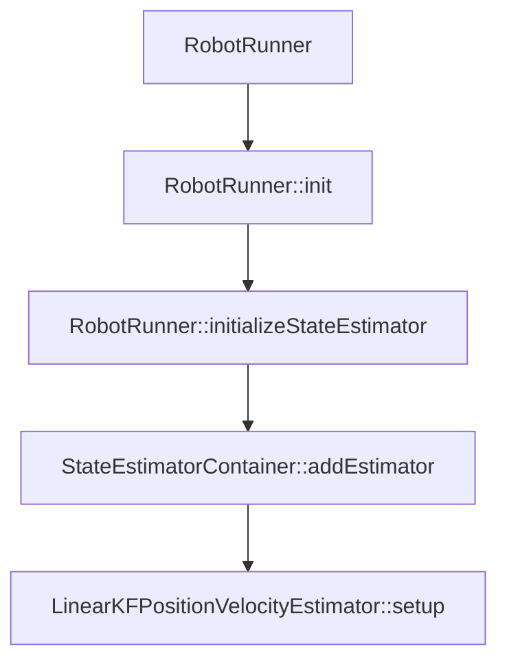
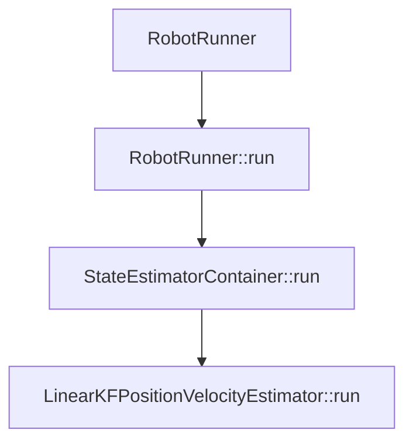

###  mini-cheetah 状态估计算法

#### 理论部分

MIT状态估计包括了姿态估计和位置速度估计，其中位置和速度估计应用了kalman滤波算法。

kalman滤波分为预测步和更新步，算法过程如下：
$$
\begin{align}
机器人的状态方程和观测方程： \\
状态方程：&x_{k+1}=A_kx_k+B_ku_k+Q_k \\
观测方程：&y_k = C_kx_{k+1}+R_k \\ 
\\ 
\\
kalman滤波：  \\
预测步：\\ &x^{-}_{k+1}=A_kx_k+B_ku_k \\
&P^{-}_{k+1}=A_kP_kA^T_{k}+Q_k \\

更新步：\\ &K_{k+1}=P^{-}_{k+1}C^T_{k+1}[C_{k+1}P^{-}_{k+1}C^T_{k+1}+R_k]^{-1} \\
&e_{k+1}=z_{k+1}-C_{k+1}x^{-}_{k+1} \\
&x_{k+1}=x^{-}_{k+1}+K_{k+1}e_{k+1} \\
&P_{k+1}=(I-K_{k+1}C_{k+1})P^{-}_{k+1}(I-K_{k+1}C_{k+1})^T+K_{k+1}R_{k+1}K_{k+1}^T
\end{align}
$$

* 其中  $x_k=[p^T \ v^T \ p_1^T \ p_2^T \ p_3^T \ p_4^T]^T$  ，$p$ 是在世界坐标系下机身的位置，$v$ 是在世界坐标系下机身的速度。 $p_i$ 是第 $i$ 条腿在世界坐标系下的位置。

#### 代码部分

* MIT状态估计类包括了姿态估计类**VectorNavOrientationEstimator**、位置速度估计类**LinearKFPositionVelocityEstimator**和触地估计类**ContactEstimator**，它们都继承于通用状态估计类**GenericEstimator**。
* **StateEstimatorContainer**类相当于是上述三种状态估计类的容器，它的构造函数参数是**VectorNavData**、**LegControllerData**、**StateEstimate**和**RobotControlParameters**类型的指针，方便传入数据和返回结果。这些指针储存在**StateEstimatorData**结构体中。**StateEstimatorContainer**在声明在**RobotRunner**类中，在**RobotRunner::init()**中完成实例化。**RobotRunner::initializeStateEstimator()**为通过调用**StateEstimatorContainer::addEstimator()**增加三个状态估计器，即姿态、位置速度和触地。同时**StateEstimatorContainer::addEstimator()**调用它们各自的**setData**和**setup**函数，相当于三个状态估计器初始化。
* **StateEstimatorContainer**中的**run**函数分别调用三个状态估计对象的**run**函数，从而实现四足机器人的状态估计。该函数在**RobotRunner::run()**被调用。
* 总结：以位置速度为例：初始化最终是**LinearKFPositionVelocityEstimator::setup**，**LinearKFPositionVelocityEstimator::run **是位置速度kalman估计的函数。





##### LinearKFPositionVelocityEstimator::setup

* 由 $k$ 时刻的机器人状态推算 $k+1$ 时刻机器人的状态方程公式如下：

$$
\begin{align}
&p_{k+1}=p_{k}+v_k*dt \\
&v_{k+1}=v_k+a_t*dt \\
&p_{1,k+1}=p_{1,k} \\
&p_{2,k+1}=p_{2,k} \\
&p_{3,k+1}=p_{3,k} \\
&p_{4,k+1}=p_{4,k} \\
\end{align}
$$

把上述机器人的状态公式写成矩阵形式，$A_k$ 、 $B_k$ 和 $u_k$ 如下：
$$
\begin{align}
&A_k = \begin{bmatrix}
I & I*dt & 0 & 0 & 0 & 0 \\
0 & I    & 0 & 0 & 0 & 0 \\
0 & 0    & I & 0 & 0 & 0 \\
0 & 0    & 0 & I & 0 & 0 \\
0 & 0    & 0 & 0 & I & 0 \\
0 & 0    & 0 & 0 & 0 & I 
\end{bmatrix}_{18\times18} 
\\
\\
&B_k= \begin{bmatrix}
0 & I*dt & 0 & 0 & 0 & 0
\end{bmatrix}^{T}_{18\times3}
\\
\\
&u_k = \begin{bmatrix}
0 & a_k & 0 & 0 & 0 & 0
\end{bmatrix}_{3\times18}
\end{align}
$$
在 **setup** 中，构造 $A_k$ 和 $ B_k $ 代码如下：

```c++
  //构造 A矩阵
  _A.block(0, 0, 3, 3) = Eigen::Matrix<T, 3, 3>::Identity();
  _A.block(0, 3, 3, 3) = dt * Eigen::Matrix<T, 3, 3>::Identity();
  _A.block(3, 3, 3, 3) = Eigen::Matrix<T, 3, 3>::Identity();
  _A.block(6, 6, 12, 12) = Eigen::Matrix<T, 12, 12>::Identity();
  //构造 B矩阵
  _B.setZero();
  _B.block(3, 0, 3, 3) = dt * Eigen::Matrix<T, 3, 3>::Identity();
```

* 由 $x_k$ 推出机器人的观测方程如下：

$$
y_{k+1}=C_kx_{k+1}+R_k \\
\begin{align}
\begin{bmatrix}
-R^W_Bp_1^B \\
-R^W_Bp_2^B \\
-R^W_Bp_3^B \\
-R^W_Bp_4^B \\
-R^W_B(\omega\times p^{B}_1+\dot{p^B_1}) \\
-R^W_B(\omega\times p^{B}_2+\dot{p^B_2}) \\
-R^W_B(\omega\times p^{B}_3+\dot{p^B_3}) \\
-R^W_B(\omega\times p^{B}_4+\dot{p^B_4}) \\
z_1^W \\
z_2^W \\
z_3^W \\
z_4^W \\
\end{bmatrix}
= \begin{bmatrix}
I_{3\times3} & 0_{3\times3}  &  -I_{3\times3} & & & \\
I_{3\times3} & 0_{3\times3}  &    & -I_{3\times3} & &\\
I_{3\times3} & 0_{3\times3}  &  & & -I_{3\times3}  &\\
I_{3\times3} & 0_{3\times3}  &  & & & -I_{3\times3} \\
0_{3\times3} & I_{3\times3}  \\
0_{3\times3} & I_{3\times3}  \\
0_{3\times3} & I_{3\times3}  \\
0_{3\times3} & I_{3\times3}  \\
0_{1\times3} & 0_{1\times3} & \vec{z} &  & & \\ 
0_{1\times3} & 0_{1\times3} &  & \vec{z} & &  \\ 
0_{1\times3} & 0_{1\times3} &  &  & \vec{z} & \\ 
0_{1\times3} & 0_{1\times3} &  &  & &\vec{z}  
\end{bmatrix}

\begin{bmatrix}
p \\
v \\
p_1 \\
p_2 \\
p_3 \\
p_4 
\end{bmatrix}
\end{align}
$$

其中 $\vec{z} = \begin{bmatrix} 0 & 0 & 1 \end{bmatrix}$ ，$R^W_B$ 表示机器人坐标系到世界坐标系的旋转矩阵，$p_i^B$ 表示第 $i$ 条腿足端在机器人坐标系中的位置，$z_i^W$ 表示第 $i$ 条腿足端在世界坐标系中的 $z$ 的分量。$\omega$ 表示机器人机身的角速度。

在 **setup** 中，构造 $C_k$  代码如下：

```c++
  Eigen::Matrix<T, Eigen::Dynamic, Eigen::Dynamic> C1(3, 6);
  C1 << Eigen::Matrix<T, 3, 3>::Identity(), Eigen::Matrix<T, 3, 3>::Zero();
  Eigen::Matrix<T, Eigen::Dynamic, Eigen::Dynamic> C2(3, 6);
  C2 << Eigen::Matrix<T, 3, 3>::Zero(), Eigen::Matrix<T, 3, 3>::Identity();
  _C.setZero();
  _C.block(0, 0, 3, 6) = C1;
  _C.block(3, 0, 3, 6) = C1;
  _C.block(6, 0, 3, 6) = C1;
  _C.block(9, 0, 3, 6) = C1;
  _C.block(0, 6, 12, 12) = T(-1) * Eigen::Matrix<T, 12, 12>::Identity();
  _C.block(12, 0, 3, 6) = C2;
  _C.block(15, 0, 3, 6) = C2;
  _C.block(18, 0, 3, 6) = C2;
  _C.block(21, 0, 3, 6) = C2;
  _C(27, 17) = T(1);
  _C(26, 14) = T(1);
  _C(25, 11) = T(1);
  _C(24, 8) = T(1);
```

最后在 **setup** 中，构造第一次迭代的噪声 $Q_0$ 和 $R_0$  ，公式和代码如下：
$$
&Q_K= \begin{bmatrix}
\frac{I*dt*noise_p}{20} & & & & & \\
& \frac{9.8*I*dt*noise_v}{20} & & & & \\
& & I*dt*noise_{p1} & & & \\
& &  & I*dt*noise_{p2}  & & \\
& & & & I*dt*noise_{p3}  & \\
& & & & & I*dt*noise_{p4} \\
\end{bmatrix}
\\
&R_K= \begin{bmatrix} 
I_{12\times12}*noise_{pfoot} & & \\
& I_{12\times12}*noise_{vfoot} & & \\
& & I_{4\times4}*noise_{z} 
\end{bmatrix}
$$

```c++
  //差个noise
  _Q0.setIdentity();
  _Q0.block(0, 0, 3, 3) = (dt / 20.f) * Eigen::Matrix<T, 3, 3>::Identity();
  _Q0.block(3, 3, 3, 3) =
      (dt * 9.8f / 20.f) * Eigen::Matrix<T, 3, 3>::Identity();
  _Q0.block(6, 6, 12, 12) = dt * Eigen::Matrix<T, 12, 12>::Identity();
  _R0.setIdentity();
```

* 总结：在 **setup** 中，构造了 $A_k$ 、$B_k$ 、$C_k$ 和 缺少 $noise$ 参数的 $Q_0$ 、$R_0$  

##### LinearKFPositionVelocityEstimator::run

在 **run** 实现了卡尔曼滤波过程，估计出机器人的位置和速度。

* 在 **run** 中首先是读取了来自 **RobotControlParameters** 对象中的 $noise$ 参数，完善了 $Q_k$ 和 $R_k$ 。其代码如下： 

 ```c++
   T process_noise_pimu =
       this->_stateEstimatorData.parameters->imu_process_noise_position;
   T process_noise_vimu =
       this->_stateEstimatorData.parameters->imu_process_noise_velocity;
   T process_noise_pfoot =
       this->_stateEstimatorData.parameters->foot_process_noise_position;
   T sensor_noise_pimu_rel_foot =
       this->_stateEstimatorData.parameters->foot_sensor_noise_position;
   T sensor_noise_vimu_rel_foot =
       this->_stateEstimatorData.parameters->foot_sensor_noise_velocity;
   T sensor_noise_zfoot =
       this->_stateEstimatorData.parameters->foot_height_sensor_noise;
 
   Eigen::Matrix<T, 18, 18> Q = Eigen::Matrix<T, 18, 18>::Identity();
   Q.block(0, 0, 3, 3) = _Q0.block(0, 0, 3, 3) * process_noise_pimu;
   Q.block(3, 3, 3, 3) = _Q0.block(3, 3, 3, 3) * process_noise_vimu;
   Q.block(6, 6, 12, 12) = _Q0.block(6, 6, 12, 12) * process_noise_pfoot;
 
   Eigen::Matrix<T, 28, 28> R = Eigen::Matrix<T, 28, 28>::Identity();
   R.block(0, 0, 12, 12) = _R0.block(0, 0, 12, 12) * sensor_noise_pimu_rel_foot;
   R.block(12, 12, 12, 12) =
       _R0.block(12, 12, 12, 12) * sensor_noise_vimu_rel_foot;
   R.block(24, 24, 4, 4) = _R0.block(24, 24, 4, 4) * sensor_noise_zfoot;
 ```

* **run** 第二步是构造观测向量 $y_{k+1}$ 并调整协方差 $Q_k$ 、$R_k$ 的大小。其代码如下：  

```c++
  for (int i = 0; i < 4; i++) {
    int i1 = 3 * i;
    Quadruped<T>& quadruped =
        *(this->_stateEstimatorData.legControllerData->quadruped);
    Vec3<T> ph = quadruped.getHipLocation(i);  // hip positions relative to CoM
    // hw_i->leg_controller->leg_datas[i].p; 
    //1.全局坐标系下足端相对与机身的位置由腿i正解加上臀部位置，通过机身到全局坐标系的旋转矩阵转化得到
    //2.观测量中的速度应该表示为足端相对于瞬间机身质心处惯性坐标系的速度，如果是足端速度在全局坐标系下速    	//度，应该需要加上机身速度。该速度通过关节速度算出足端末端速度vrel,再通过机身角速度w和旋转矩阵转换到  	//惯性坐标系中
      
    //足端相对与质心的位置
    Vec3<T> p_rel = ph + this->_stateEstimatorData.legControllerData[i].p;
    // hw_i->leg_controller->leg_datas[i].v;
    Vec3<T> dp_rel = this->_stateEstimatorData.legControllerData[i].v;  
    // op1 = op + oRb*bp1  ==> -oRb*bp1 = op - op1
    Vec3<T> p_f = Rbod * p_rel;

  
    Vec3<T> dp_f =
        Rbod *
        (this->_stateEstimatorData.result->omegaBody.cross(p_rel) + dp_rel);

    qindex = 6 + i1;
    rindex1 = i1;
    rindex2 = 12 + i1;
    rindex3 = 24 + i;

    T trust = T(1);
    T phase = fmin(this->_stateEstimatorData.result->contactEstimate(i), T(1));
    //T trust_window = T(0.25);
    T trust_window = T(0.2);


   
    // 腿部速度和高度z以预测值为准。具体过程如下，对每条腿引入置信度trust和腿支撑状态相位phase,
    // 摆腿时phase=0，支撑时pahse由0变化到1。
    if (phase < trust_window) {
      trust = phase / trust_window;
    } else if (phase > (T(1) - trust_window)) {
      trust = (T(1) - phase) / trust_window;
    }
    //T high_suspect_number(1000);
    T high_suspect_number(100);

    // printf("Trust %d: %.3f\n", i, trust);
    // 当腿处于摆动状态时，用机身速度表示全局坐标系下腿末端相对机身质心速度，不准，
    // 所以在摆动状态下将速度观测值的协方差扩大100倍，以预测值为准。在支撑时，质心速度和vf大小相等，
    // 符号相反，由于观测矩阵中系数取正，所以这里用vf的负值。

    // 当腿处于摆动相时，提高腿的位置预测误差方差100倍，同时提高观测误差中腿的速度和高度z的观测误差100   	 //倍，即在摆动时，腿部位置以观测为准，
    Q.block(qindex, qindex, 3, 3) =
        (T(1) + (T(1) - trust) * high_suspect_number) * Q.block(qindex, qindex, 3, 3);
      
    R.block(rindex1, rindex1, 3, 3) = 1 * R.block(rindex1, rindex1, 3, 3);
    R.block(rindex2, rindex2, 3, 3) =
        (T(1) + (T(1) - trust) * high_suspect_number) * R.block(rindex2, rindex2, 3, 3);
    R(rindex3, rindex3) =
        (T(1) + (T(1) - trust) * high_suspect_number) * R(rindex3, rindex3);

    trusts(i) = trust;

  

    _ps.segment(i1, 3) = -p_f;
    _vs.segment(i1, 3) = (1.0f - trust) * v0 + trust * (-dp_f);
    pzs(i) = (1.0f - trust) * (p0(2) + p_f(2));
  }

  Eigen::Matrix<T, 28, 1> y;
  //构造 zk+1
  y << _ps, _vs, pzs;
```


#### 参考资料

* [State Estimation for Legged Robots -Consistent Fusion of Leg Kinematics and IMU]()

* [Cheetah-Software方案分析](https://blog.csdn.net/Kalenee/article/details/126440918)
* [MIT开源四足机器人状态估计算法](https://zhuanlan.zhihu.com/p/354034309)


